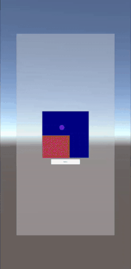

# Rendering SurfaceTexture To Unity

Android(Java)のSurfaceTextureのテクスチャをUnityで描画する方法  
https://www.hiramine.com/programming/rendering_surfacetexture_to_unity/index.html

## Screenshots : スクリーンショット

## Requirements : 必要条件、依存関係
- Android Studio 4.2.2
- Unity 2020.3.12f1

## Author : 作者
Nobuki HIRAMINE : http://www.hiramine.com

## License : ライセンス
Copyright 2021 Nobuki HIRAMINE  
The source code is licensed under the Apache License, Version 2.0.  
See the [LICENSE](LICENSE) file for more details.  
(本アプリケーションのソースコードのライセンスは、「Apache License, Version 2.0」です。  
詳細は「[LICENSE](LICENSE)」ファイルを参照ください。)

